# Turtlebot3 Self-Parking
## Video Demo
See the demo in [Youtube](https://www.youtube.com/watch?v=LZPb7w0aY1Y&feature=youtu.be).

## Set up
* Ubuntu 18.04

* [ROS melodic](http://wiki.ros.org/melodic)

* Turtlebot3 - burger

   Host system - Raspberry Pi 3

   Slave system - OpenCR controller board

* Camera - Raspberry Pi ‘fish-eye’ camera

## Project Goal
This project focuses on the self-parking task of ROS Turtlebot3 by using a 2D-RGB camera as external perception device. During the task, the turtlebot is going to follow the lanes until it detects a parking sign. Then it will stop the lane following and try to find the parking slot. The parking lanes are painted red to be identified. Once the parking slot is detected, turtlebot can get the location of parking point relative to its footprint frame. Then it will drive itself towards that slot and adjust the angle of itself to park into the spot in a nice position.

## Project Pipeline
1. Camera calibration
2. Lane following
3. Parking sign detection
4. Parking lane detection
5. Plane localization
6. Navigation

### Camera Calibration

The camera mounted on turtlebot is Raspberry Pi ‘fish-eye’ camera, thus it has very large distortion. But the images needed for this project should have little distortion so that not to affect the image processing steps. To rectify the distortion, I mainly use the ROS [MonocularCalibration](http://wiki.ros.org/camera_calibration/Tutorials/MonocularCalibration) API. It uses the checkerboard calibration method, which takes use of the geometry characteristics of checkerboard to calculate the distortion parameters and camera matrix of the camera. The images from the camera then will be remapped to a new image with less distortion. Here is the result before and after camera calibration. As can be observed in the figure, some curves, which are straight lines in real world.

  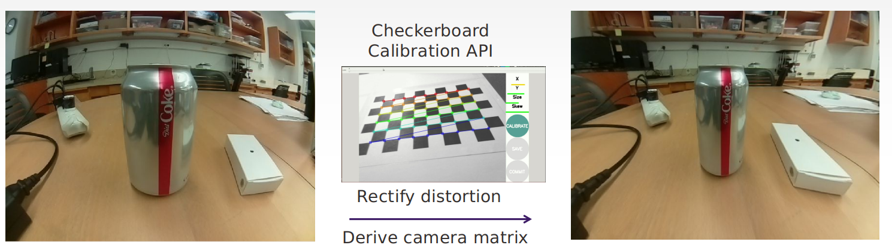

  <b>camera calibration</b> 

### Lane Following
#### Project Lanes with Homography Matrix
To find the lanes on the ground, and for tracking the lanes in the next few steps, part of the image is cropped out and then the cropped image is reprojected by Homography Matrix. This step is to preserve the geometry characteristics of the lanes. The projection process is shown below:

  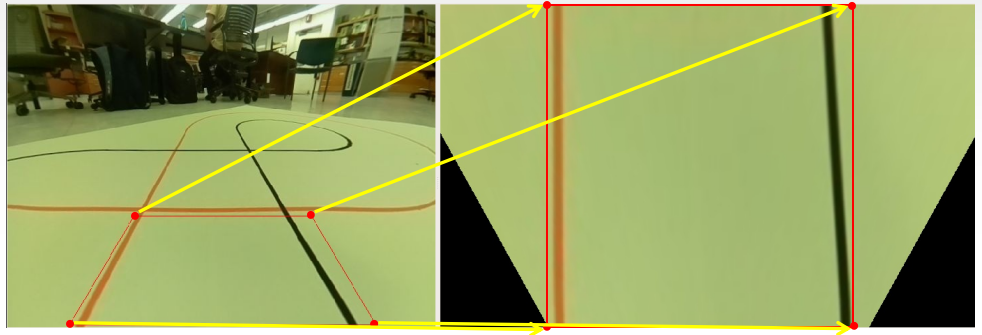

  <b>Lanes projection by Homography Matrix</b> 

#### Follow Lanes
Then the projected image is transformed into HSV space to filter out the lanes from the plane background. I set a threshold by test and masked the desired color with white. Image Histogram is used to calculate the middle point of two lanes. I calculate the histogram of pixel intensities align with image x-axis. The two maximum values in histogram are viewed as the midpoints of left lane **Xlm** and the right lane **Xrm**. The midpoint of the two lanes **Xmr** is just the average of **Xlm** and **Xrm**.

  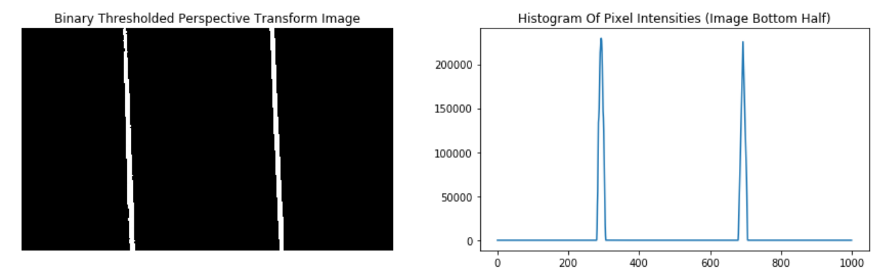

  <b>Filtered lanes and histogram</b> 

To keep turtlebot in the middle of the lanse, I apply a PI controller to control the angular velocity *wz*, which is:

  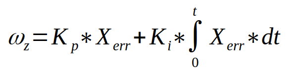

Here is the example of how it works when turtlebot goes into a curve:

  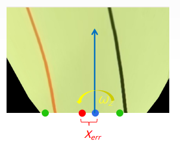

  <b>Lane following by PI controller</b> 

The two green points are the two middle points of left lane and right lane respectively, which have the two maximum pixel histogram intensity. The red point is the average point of them, which is viewed as the **Xmr**. The blue point is the actual position **Xmp** of turtlebot while the blue arrow means the current linear velocity. Thus, the **Xerr** is just the subtraction of these two values. Here we apply the PI controller equation to this error and get the desired angular velocity to adjust the steering angle.

### Parking Sign Detection
To check if there is a parking sign shows up in the view of camera, taking the balance between computation speed and accuracy into consideration for online detection, I used the [*SIFT*](https://www.cs.ubc.ca/~lowe/papers/ijcv04.pdf) (Scale Invariant Feature Transform, invented by David G.Lowe) to detect the parking sign.To increase detection robustness, I collect several [parking sign templates](file/detect_sign) from different angles to increase the robustness for detection. Here is the result of sign detection:

  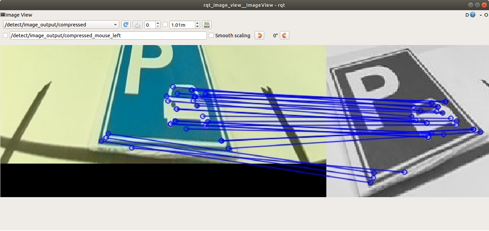

  <b>Parking sign matching</b> 

### Parking Lanes Detection
#### Lines Extraction
I transfer the each frame of the camera video into HSV space to filter out the color I want (which is red in this case).

  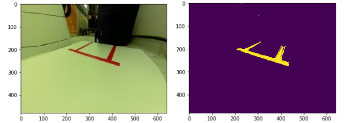

  <b>HSV space to filter out the lanes</b> 

Then *Canny Edge Detection* is applied to detect the edge in HSV image. To extract the lines from those edges, *Hough Line Transform* is applied. Here is the result of the lines detection:

  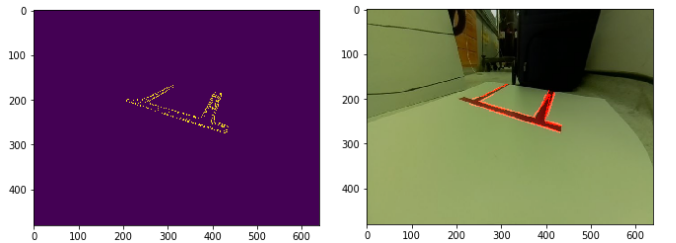

  <b>Canny Edge Detection and Hough Line Transform</b> 

#### Lines Clustering
To merge the detected lines, also considering that multiple parking slots need to be detected (number of clusters not known), I use [*SciPy Hierarchical Clustering*](https://docs.scipy.org/doc/scipy/reference/cluster.hierarchy.html). It is an adaptive clustering method which keeps processing until all the lines merged into one cluster. Unlike ***K-means***, it starts searching at each line's representing data and keeps enlarge searching region. I set a threshold spatial distance during the clustering process to get the cluster size. Here is the clustering process and result:

  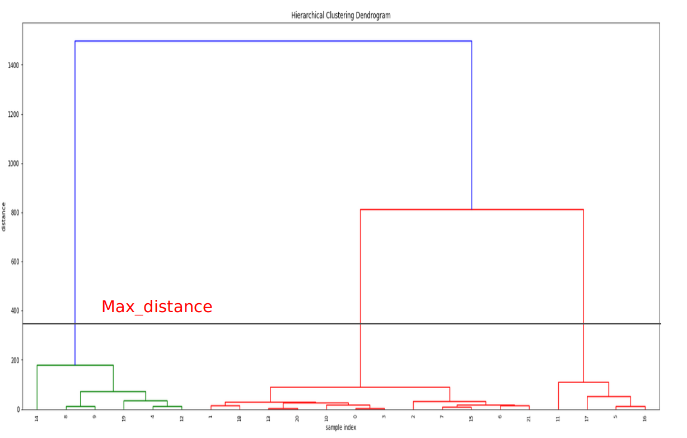

  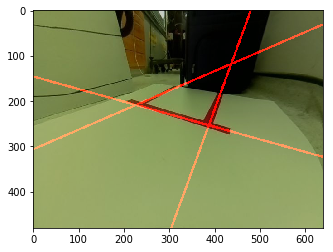

  <b>SciPy Hierarchical Clustering</b> 

It can also handle the condition with multiple parking slots:

  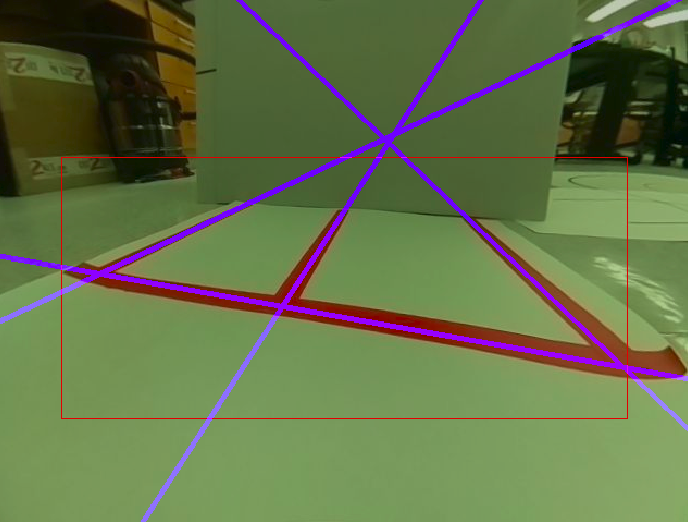

  <b>Multiple parking slots lanes detection</b> 

Since this clustering method merges the lines' representing data based on their spatial distance, so using *(k,b)*, where k is slope and b is intercept, is not suitable because *k* goes exponentially as lines go from horizontal direction to vertical direction. I use polar coordinate representation *(ρ，θ)* to represent each line and it works well.

Finally, I consider the midpoint of two lanes intersections to be the desired parking point.

  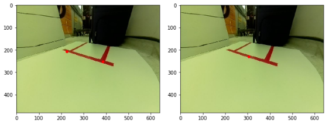

  <b>Parking point derived by merged lanes</b> 

### Plane Localization
Given the parking point coordinate in image frame, the next goal is to derive the parking point configuration relative to camera frame.

  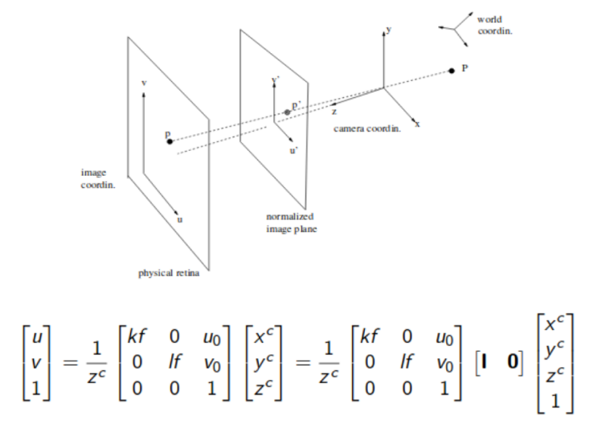

  <b>Camera transformation concatenation</b> 

Also, the configuration of camera relative to its footprint frame is given in *urdf*, we have

  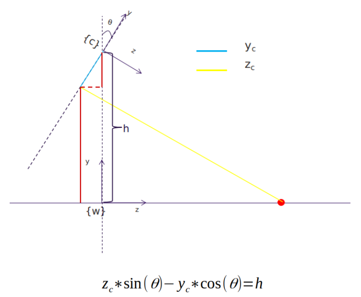

  <b>Camera transformation concatenation</b> 

So with 3 equations and 3 unknowns, the configuration of parking point relative to footprint frame is easy to get:

  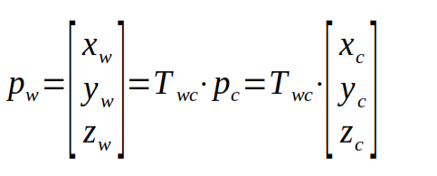

### Navigation
Given the parking point configuration, now it’s time to navigate turtlebot to the parking slot. Turtlebot uses *twist* message to navigate, so this step is just a feed forward control to approach the parking point. When it gets to that point, the next step is reusing the image projected by Homography Matrix and then use a PI controller to adjust the angle to face straight towards to the slot then park itself into it.

## Stretch Goal
This project focuses on a low-level task of autonomous driving techniques. The workflow seems not much complicated, but I think these low-level autonomous driving techniques are durable for warehouse robotics due to considering the low cost on that. Only if it’s robust enough, the robot can be able to finish simple tasks in a known environment.

There are still some drawbacks in this project. For example, if the parking slot is far away from the robot, it can not detect it well due to the failure of color filtering and the localization of it is quite simple, which can not handle more complex task. Also, the SIFT detection method is computationally expensive.

So my stretch goal is to first apply some techniques like SVM or some simple deep neural networks to detect the parking slot first, and then apply further algorithm to get the parking point configuration. Another goal is to use lidar combined with the usage of odometry to do some slam to better map the world and localize the robot, which is useful to finish more complicated tasks.
